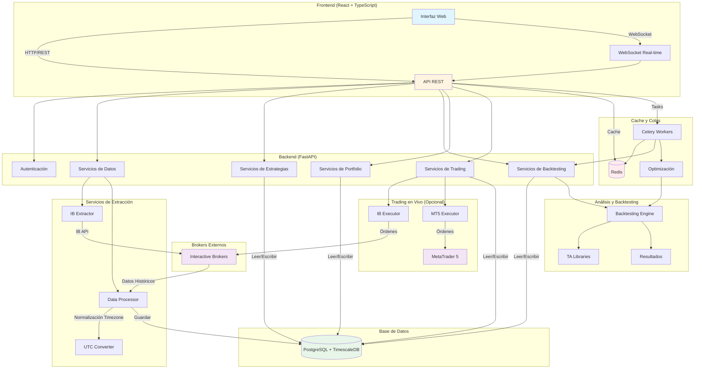
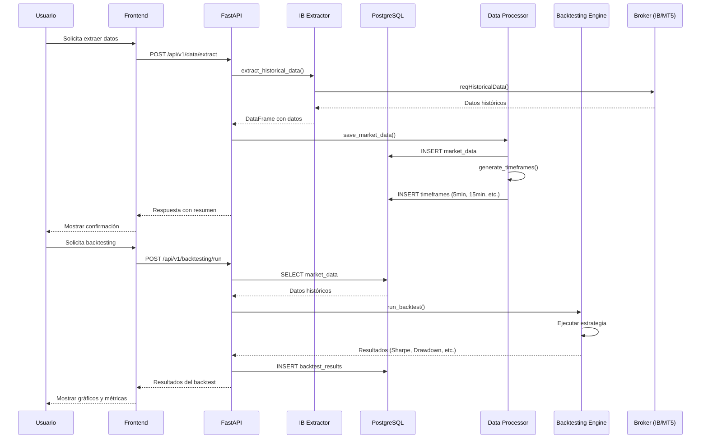

# 🏗️ Diagrama de Arquitectura - G4QC Trading Platform

## Arquitectura General del Sistema

## Flujo de Datos Detallado

## Componentes y Responsabilidades Detalladas

### 📱 **FRONTEND (React + TypeScript)**

| Componente | Responsabilidad | Tecnologías |
|------------|----------------|-------------|
| **Dashboard** | Panel principal con métricas, gráficos de equity curve, resumen de estrategias activas | React, Recharts, Material-UI |
| **Data Manager** | Interfaz para extraer datos, seleccionar símbolos, configurar timeframes, ver historial de extracciones | React, Formik, React Query |
| **Strategy Builder** | Editor de código Python para crear/editar estrategias, validación de sintaxis, preview | React, Monaco Editor, CodeMirror |
| **Backtesting** | Configurar parámetros de backtest, seleccionar rango de fechas, ver resultados con gráficos interactivos | React, Plotly.js, D3.js |
| **Portfolio Analyzer** | Análisis de riesgo, correlaciones, heatmaps, métricas de portfolio | React, Pyfolio (backend), Chart.js |
| **Live Trading** | Monitoreo en tiempo real de posiciones, órdenes, P&L, alertas | React, WebSocket, Real-time updates |

---

### 🔧 **BACKEND - API REST (FastAPI)**

| Componente | Responsabilidad | Endpoints Principales |
|------------|----------------|----------------------|
| **API Gateway** | Punto de entrada, autenticación, rate limiting, CORS | `/api/v1/*` |
| **Data Endpoints** | Extracción y consulta de datos históricos | `POST /extract`, `GET /data/{symbol}` |
| **Strategy Endpoints** | CRUD de estrategias, versionado, validación | `POST /strategies`, `GET /strategies/{id}` |
| **Backtesting Endpoints** | Ejecutar backtests, obtener resultados, comparar estrategias | `POST /backtesting/run`, `GET /backtesting/{id}` |
| **Portfolio Endpoints** | Análisis de portfolio, métricas de riesgo, correlaciones | `GET /portfolio/analyze`, `GET /portfolio/risk` |
| **Trading Endpoints** | Ejecutar órdenes, monitorear posiciones, historial de trades | `POST /trading/order`, `GET /trading/positions` |

---

### 📊 **SERVICIOS DE EXTRACCIÓN DE DATOS**

| Servicio | Responsabilidad | Detalles Técnicos |
|----------|----------------|-------------------|
| **IB Extractor** | Conectar con Interactive Brokers API, extraer datos históricos en bloques, manejar reconexiones | Clase `IBDataExtractor` hereda de `EClient` y `EWrapper`, usa threading para callbacks asíncronos. **ÚNICA fuente de datos históricos** |
| **Data Processor** | Procesar datos raw, **normalizar timezones a UTC**, generar timeframes adicionales (5min, 15min, etc.) desde 1min, validar y limpiar datos | Usa pandas para resampling, **pytz para normalización de timezones**, guarda en PostgreSQL con prevención de duplicados. Detecta automáticamente timezone según símbolo (CME→Chicago, NYMEX→NY) |

**Flujo de Extracción:**
1. Usuario solicita datos → API recibe request
2. IB Extractor se conecta a TWS/Gateway
3. Solicita datos en bloques (para evitar límites de IB)
4. Recibe datos vía callbacks `historicalData()`
5. Data Processor limpia y valida datos
6. Guarda en PostgreSQL (tabla `market_data`)
7. Genera timeframes adicionales automáticamente
8. Retorna resumen al usuario

---

### 🗄️ **BASE DE DATOS (PostgreSQL + TimescaleDB)**

| Tabla/Componente | Responsabilidad | Estructura Clave |
|------------------|----------------|------------------|
| **market_data** | Almacenar datos OHLCV históricos de todos los símbolos y timeframes | `symbol`, `timeframe`, `timestamp`, `open`, `high`, `low`, `close`, `volume` |
| **strategies** | Almacenar código de estrategias, parámetros, metadatos, versionado | `id`, `name`, `code`, `parameters`, `version`, `created_at` |
| **backtest_results** | Resultados de backtests ejecutados, métricas, equity curve | `strategy_id`, `start_date`, `end_date`, `sharpe_ratio`, `max_drawdown`, `total_return` |
| **trades** | Historial de trades ejecutados (backtest y live) | `strategy_id`, `symbol`, `entry_time`, `exit_time`, `entry_price`, `exit_price`, `pnl` |
| **portfolio_positions** | Posiciones actuales en trading en vivo | `strategy_id`, `symbol`, `quantity`, `entry_price`, `current_price`, `unrealized_pnl` |

**Optimizaciones:**
- **TimescaleDB Hypertable**: Particionado automático por tiempo para queries eficientes
- **Índices compuestos**: `(symbol, timeframe, timestamp)` para búsquedas rápidas
- **Retención de datos**: Políticas automáticas para datos antiguos

---

### 🧮 **MOTOR DE BACKTESTING**

| Componente | Responsabilidad | Tecnologías |
|------------|----------------|-------------|
| **Backtesting Engine** | Ejecutar estrategias sobre datos históricos, simular órdenes, calcular P&L | Backtrader o motor custom |
| **TA Libraries** | Indicadores técnicos (MA, RSI, MACD, Bollinger Bands, etc.) | TA-Lib, pandas-ta |
| **Optimizer** | Optimización de parámetros (Grid Search, Genetic Algorithms) | Scipy, DEAP |
| **Robustness Tester** | Walk Forward Analysis, Monte Carlo Simulation, Out-of-sample testing | Implementación custom |

**Flujo de Backtesting:**
1. Usuario selecciona estrategia y rango de fechas
2. Engine carga datos históricos desde PostgreSQL
3. Ejecuta estrategia bar por bar simulando órdenes
4. Calcula métricas: Sharpe, Sortino, Max Drawdown, Win Rate, etc.
5. Genera equity curve y estadísticas
6. Guarda resultados en `backtest_results`
7. Retorna resultados al frontend para visualización

---

### 📈 **ANÁLISIS DE PORTFOLIO**

| Componente | Responsabilidad | Métricas Calculadas |
|------------|----------------|---------------------|
| **Portfolio Analyzer** | Analizar múltiples estrategias como portfolio, calcular riesgo conjunto | Sharpe Ratio, Sortino Ratio, VaR, CVaR |
| **Correlation Analyzer** | Calcular correlaciones entre estrategias/instrumentos | Matriz de correlación, heatmaps |
| **Risk Manager** | Gestión de riesgo, position sizing, money management | Kelly Criterion, Fixed Fractional, Risk per Trade |
| **Pyfolio Integration** | Análisis avanzado usando Pyfolio | Tear sheets, returns analysis, drawdown analysis |

---

### 🔄 **TRADING EN VIVO**

| Componente | Responsabilidad | Detalles |
|------------|----------------|----------|
| **IB Executor** | Ejecutar órdenes en Interactive Brokers, monitorear posiciones, manejar callbacks | Usa IB API para `placeOrder()`, `reqPositions()`, maneja eventos de ejecución |
| **MT5 Executor** | Ejecutar órdenes en MetaTrader 5, sincronizar con terminal MT5 | Usa MT5 API, maneja diferentes tipos de órdenes (Market, Limit, Stop) |
| **Error Handler** | Manejo robusto de errores, reintentos, fallbacks, logging | Reintentos exponenciales, alertas, logging detallado |
| **Position Monitor** | Monitoreo en tiempo real de posiciones, P&L, actualizaciones vía WebSocket | WebSocket para updates en tiempo real al frontend |

**Flujo de Trading en Vivo:**
1. Estrategia genera señal de compra/venta
2. Trading Service valida la señal
3. Ejecutor envía orden al broker (IB o MT5)
4. Broker confirma ejecución
5. Se actualiza posición en base de datos
6. WebSocket notifica al frontend
7. Usuario ve actualización en tiempo real

---

### ⚙️ **INFRAESTRUCTURA Y SERVICIOS AUXILIARES**

| Componente | Responsabilidad | Tecnologías |
|------------|----------------|-------------|
| **Redis Cache** | Cache de datos frecuentes, sesiones, resultados de backtests | Redis |
| **Celery Workers** | Tareas asíncronas: backtesting largo, optimización, actualización de datos | Celery, Redis como broker |
| **WebSocket Server** | Actualizaciones en tiempo real: precios, posiciones, alertas | FastAPI WebSockets |
| **Scheduler** | Tareas programadas: actualización automática de datos, ejecución de estrategias | Celery Beat |

---

## Flujo Completo: De Datos a Trading

```mermaid
flowchart LR
    A[1. Extracción Datos] --> B[2. Almacenamiento DB]
    B --> C[3. Desarrollo Estrategia]
    C --> D[4. Backtesting]
    D --> E[5. Optimización]
    E --> F[6. Pruebas Robustez]
    F --> G[7. Análisis Portfolio]
    G --> H[8. Trading en Vivo]
    H --> I[9. Monitoreo Real-time]
    
    style A fill:#e3f2fd
    style B fill:#e8f5e9
    style C fill:#fff3e0
    style D fill:#f3e5f5
    style E fill:#fce4ec
    style F fill:#e0f2f1
    style G fill:#fff8e1
    style H fill:#ffebee
    style I fill:#e1f5fe
```

### Detalle de cada etapa:

1. **Extracción Datos**: IB → Raw data → Normalización Timezone (UTC) → Validación
2. **Almacenamiento**: PostgreSQL con timeframes múltiples
3. **Desarrollo**: Editor de código → Validación → Guardado
4. **Backtesting**: Cargar datos → Ejecutar estrategia → Calcular métricas
5. **Optimización**: Grid Search/GA → Encontrar mejores parámetros
6. **Robustez**: Walk Forward, Monte Carlo, Out-of-sample
7. **Portfolio**: Análisis conjunto, correlaciones, riesgo
8. **Trading**: Ejecutar órdenes → Monitorear → Gestionar riesgo
9. **Monitoreo**: WebSocket → Actualizaciones en tiempo real → Alertas

---

## Stack Tecnológico Completo

### Backend
- **Framework**: FastAPI 0.104+
- **ORM**: SQLAlchemy 2.0+
- **DB**: PostgreSQL 15+ con TimescaleDB
- **Cache**: Redis 7+
- **Tasks**: Celery + Redis
- **API Docs**: Swagger/OpenAPI automático

### Frontend
- **Framework**: React 18+ con TypeScript
- **UI**: Material-UI o Ant Design
- **Charts**: Plotly.js, Recharts
- **State**: Redux Toolkit o Zustand
- **HTTP**: Axios o React Query

### Integraciones
- **IB**: ibapi (Interactive Brokers API)
- **MT5**: MetaTrader5 Python API
- **TA**: TA-Lib, pandas-ta
- **Backtesting**: Backtrader o custom engine
- **Portfolio**: Pyfolio, QuantStats

---

## Seguridad y Escalabilidad

### Seguridad
- Autenticación JWT
- Rate limiting por usuario
- Validación de inputs (Pydantic)
- Sanitización de código de estrategias
- Encriptación de credenciales de brokers

### Escalabilidad
- Horizontal scaling con múltiples workers
- Load balancing para API
- Particionado de base de datos (TimescaleDB)
- Cache agresivo en Redis
- Tareas asíncronas para procesos largos

---

**Última actualización**: Enero 2024
**Versión**: 0.1.0 (MVP)

